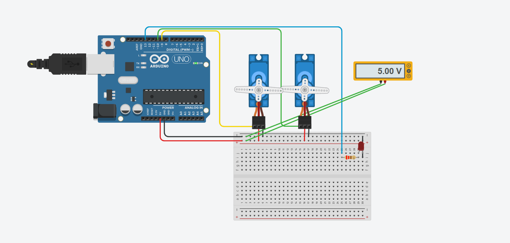
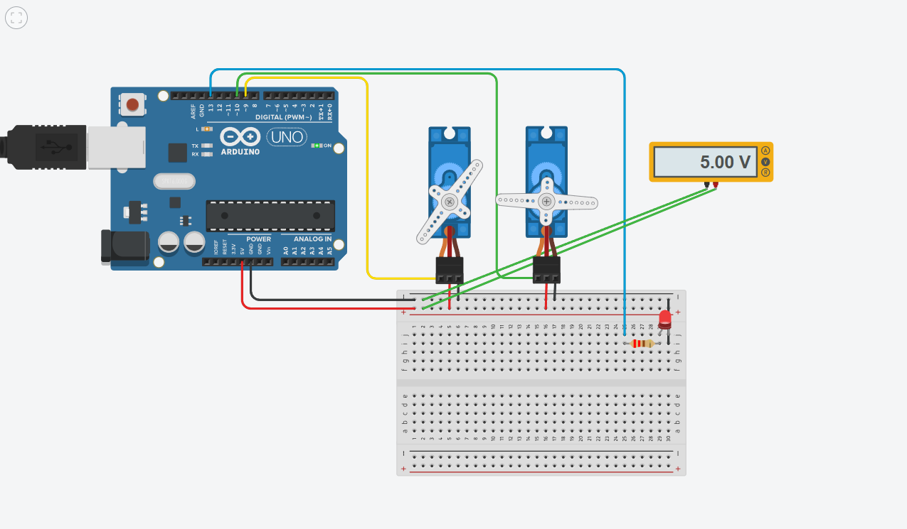
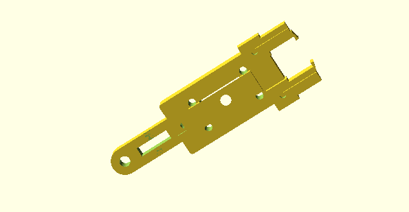
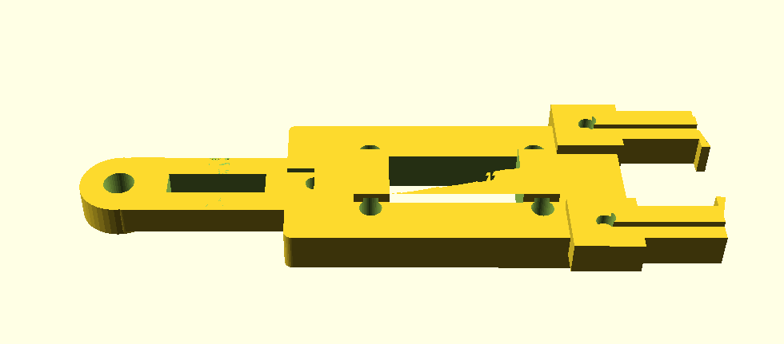

# 🦾 Braço Robótico de Coleta de Amostras — Docking & Retrieval

> Projeto de sistemas embarcados simulando um braço robótico para manipulação de carga em ambiente de microgravidade, controlado via Monitor Serial.

---

## 📁 Estrutura do Repositório

```
gs-makerlab-1sem/
│
├── src/
│   └── braco_robotico.ino       # Código Arduino (controle via Serial)
│
├── model/
│   ├── garra_robotica.scad      # Arquivo nativo OpenSCAD
│   └── garra_robotica.stl       # Exportação universal para impressão 3D
│
├── images/
│   ├── circuito_tinkercad.png   # Print do circuito simulado
│   └── modelo_3d_render.png     # Render da garra no OpenSCAD
│
└── README.md
```

---

## 🔧 Hardware utilizado

| Componente | Quantidade | Observação |
|---|---|---|
| Arduino Uno | 1 | Microcontrolador principal |
| Servo motor SG90 (9g) | 2 | Articulação do ombro (pino 9) e garra (pino 10) |
| LED | 1 | Indicador de status — pino 13 |
| Resistor 220Ω | 1 | Proteção do LED |
| Protoboard | 1 | Distribuição de GND e VCC |
| Fonte 5V | 1 | Alimentação dos servos |

---

## 🔌 Esquema de Conexões

```
Arduino Uno
│
├── Pino  9  →  Sinal  (laranja) Servo 1 — OMBRO
├── Pino 10  →  Sinal  (laranja) Servo 2 — GARRA
├── Pino 13  →  Ânodo  (+) LED → Resistor 220Ω → GND
├── 5V       →  VCC    (vermelho) ambos os servos
└── GND      →  GND    (marrom)  ambos os servos + LED
```

---

## 🖥️ Como simular no Tinkercad

1. Acesse o link público do projeto:  
   **[🔗 Abrir projeto no Tinkercad](https://www.tinkercad.com/things/j7mgaKusegr/editel?returnTo=%2Fdashboard%2Fdesigns%2Fall&sharecode=zOyf7BPZ7nfplVpphuhD8V7wv2v9yjqgMlMJyJ0MA4w)**

2. Clique em **"Tinker this"** para abrir uma cópia editável, ou apenas visualize.

3. Clique em **"Iniciar Simulação"** (botão verde no canto superior direito).

4. Com a simulação rodando, clique em **"Monitor Serial"** na parte inferior da tela.

5. Certifique-se de que a velocidade está em **9600 baud**.

---

## 🕹️ Como operar o braço — Comandos via Monitor Serial

Com a simulação ativa e o Monitor Serial aberto, digite **uma letra** e pressione **Enter**:

| Comando | Ação | Servo afetado | Ângulo |
|---|---|---|---|
| `U` | **Up** — sobe o braço | Ombro (pino 9) | 90° → 150° |
| `D` | **Down** — desce o braço | Ombro (pino 9) | 90° → 30° |
| `O` | **Open** — abre a garra | Garra (pino 10) | 90° → 160° |
| `C` | **Close** — fecha a garra | Garra (pino 10) | 90° → 20° |
| `R` | **Reset** — volta ao centro | Ambos | 90° |

> 💡 O sistema aceita letras minúsculas e maiúsculas. O LED pisca a cada comando recebido.

### Sequência de captura de amostra (exemplo):
```
1. D   → desce o braço até a amostra
2. O   → abre a garra
3. U   → posiciona sobre a amostra
4. C   → fecha a garra (captura)
5. R   → retorna à posição neutra
```

---

## 🖨️ Modelo 3D — Garra Robótica

O modelo foi desenvolvido em **OpenSCAD** e representa a garra do braço com encaixe para servo 9g.

### Como abrir e exportar:

1. Instale o OpenSCAD: [openscad.org](https://openscad.org)
2. Abra o arquivo `modelo-3d/garra_robotica.scad`
3. Pressione **F5** para visualizar ou **F6** para renderizar
4. Para exportar: `File > Export > Export as STL`

### Variáveis ajustáveis no topo do arquivo:

| Variável | Descrição | Padrão |
|---|---|---|
| `dedo_comp` | Comprimento dos dedos da garra | 40 mm |
| `abertura` | Distância entre os dedos | 18 mm |
| `servo_comp` | Comprimento do servo (cavidade) | 23 mm |
| `base_comp` | Comprimento da base | 60 mm |

---

## 📸 Imagens do Projeto

### Circuito no Tinkercad




### Modelo 3D — Garra



---

## 🚀 Contexto do Projeto

Este projeto simula um sistema de **Docking & Retrieval** para ambientes espaciais, onde robôs precisam manipular amostras em microgravidade sem contato humano direto. O controle serial representa uma interface de telemetria, e o design da garra foi pensado para prender objetos sem depender de gravidade.

---

## Time de Desenvolvimento

 - Guilherme Daher - 98611
 - Gabriel Freitas - 550187
 - Heitor Nobre - 551539
 - Vinicius Yamashita - 550908
 - Lucca Alexandre - 99700

## 🛠️ Tecnologias utilizadas

- [Arduino IDE](https://www.arduino.cc/en/software)
- [Tinkercad Circuits](https://www.tinkercad.com)
- [OpenSCAD](https://openscad.org)
